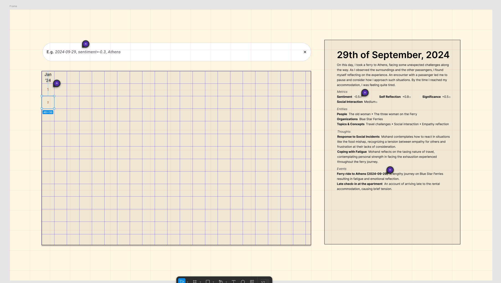

# A project to visualize my diary entries

## Design vision


## Diary schema
```json
{
  "name": "diary_schema",
  "strict": true,
  "schema": {
    "type": "object",
    "properties": {
      "date": {
        "type": "string",
        "description": "The date of the diary entry."
      },
      "sentiment": {
        "type": "object",
        "properties": {
          "category": {
            "type": "string",
            "description": "Overall sentiment category for the entry (Positive, Negative, or Neutral)."
          },
          "sentiment_score": {
            "type": "number",
            "description": "Sentiment score on a scale from -1 to +1."
          },
          "emotional_rationale": {
            "type": "string",
            "description": "Deep insight into the overall feel of the day."
          }
        },
        "required": [
          "category",
          "sentiment_score",
          "emotional_rationale"
        ],
        "additionalProperties": false
      },
      "emotions": {
        "type": "object",
        "properties": {
          "anger": {
            "type": "number",
            "description": "Intensity score for anger."
          },
          "disgust": {
            "type": "number",
            "description": "Intensity score for disgust."
          },
          "fear": {
            "type": "number",
            "description": "Intensity score for fear."
          },
          "happiness": {
            "type": "number",
            "description": "Intensity score for happiness."
          },
          "sadness": {
            "type": "number",
            "description": "Intensity score for sadness."
          },
          "surprise": {
            "type": "number",
            "description": "Intensity score for surprise."
          }
        },
        "required": [
          "anger",
          "disgust",
          "fear",
          "happiness",
          "sadness",
          "surprise"
        ],
        "additionalProperties": false
      },
      "entry_summary": {
        "type": "string",
        "description": "A detailed summary of the day's events."
      },
      "self_reflection": {
        "type": "object",
        "properties": {
          "reflection_score": {
            "type": "number",
            "description": "Score assessing self-reflectiveness of the entry (from 0 to 1)."
          },
          "reason": {
            "type": "string",
            "description": "Justification for the reflection score."
          }
        },
        "required": [
          "reflection_score",
          "reason"
        ],
        "additionalProperties": false
      },
      "significance": {
        "type": "object",
        "properties": {
          "score": {
            "type": "number",
            "description": "Significance score of the entry (from 0 to 1)."
          },
          "level": {
            "type": "string",
            "description": "Classification of the entry's focus (Routine, Significant, or Pivotal)."
          },
          "reason": {
            "type": "string",
            "description": "Justification for the significance level."
          }
        },
        "required": [
          "score",
          "level",
          "reason"
        ],
        "additionalProperties": false
      },
      "social_interaction": {
        "type": "object",
        "properties": {
          "intensity": {
            "type": "string",
            "description": "Intensity of social interactions (e.g., High, Medium, Low)."
          },
          "reason": {
            "type": "string",
            "description": "Justification for the identified interaction level."
          }
        },
        "required": [
          "intensity",
          "reason"
        ],
        "additionalProperties": false
      },
      "entities": {
        "type": "object",
        "properties": {
          "people": {
            "type": "array",
            "description": "List of individuals mentioned in the entry.",
            "items": {
              "type": "string"
            }
          },
          "organizations": {
            "type": "array",
            "description": "List of organizations referenced in the entry.",
            "items": {
              "type": "string"
            }
          },
          "topics_concepts": {
            "type": "array",
            "description": "Core ideas or themes present in the entry.",
            "items": {
              "type": "string"
            }
          }
        },
        "required": [
          "people",
          "organizations",
          "topics_concepts"
        ],
        "additionalProperties": false
      },
      "thoughts": {
        "type": "array",
        "description": "Key thoughts or reflections in the entry.",
        "items": {
          "type": "object",
          "properties": {
            "name": {
              "type": "string",
              "description": "A short label or title for the thought."
            },
            "description": {
              "type": "string",
              "description": "Brief explanation or elaboration on the thought."
            }
          },
          "required": [
            "name",
            "description"
          ],
          "additionalProperties": false
        }
      },
      "events": {
        "type": "array",
        "description": "Specific events mentioned in the entry.",
        "items": {
          "type": "object",
          "properties": {
            "event_name": {
              "type": "string",
              "description": "Specific event referenced."
            },
            "date_time": {
              "type": "string",
              "description": "Date or time associated with the event."
            },
            "refers_to": {
              "type": "string",
              "description": "The context or significance of the event."
            }
          },
          "required": [
            "event_name",
            "date_time",
            "refers_to"
          ],
          "additionalProperties": false
        }
      },
      "trend_analysis": {
        "type": "array",
        "description": "Observations of trends or patterns across multiple entries.",
        "items": {
          "type": "object",
          "properties": {
            "name": {
              "type": "string",
              "description": "Name of the observed pattern."
            },
            "description": {
              "type": "string",
              "description": "Details about the pattern."
            }
          },
          "required": [
            "name",
            "description"
          ],
          "additionalProperties": false
        }
      },
      "media_references": {
        "type": "array",
        "description": "Comments on any media included in the entry.",
        "items": {
          "type": "object",
          "properties": {
            "name": {
              "type": "string",
              "description": "Name of the media."
            },
            "type": {
              "type": "string",
              "description": "Type of the media (e.g., image, video, audio)."
            },
            "description": {
              "type": "string",
              "description": "Description of the media."
            }
          },
          "required": [
            "name",
            "type",
            "description"
          ],
          "additionalProperties": false
        }
      }
    },
    "required": [
      "date",
      "sentiment",
      "emotions",
      "entry_summary",
      "self_reflection",
      "significance",
      "social_interaction",
      "entities",
      "thoughts",
      "events",
      "trend_analysis",
      "media_references"
    ],
    "additionalProperties": false
  }
}
```